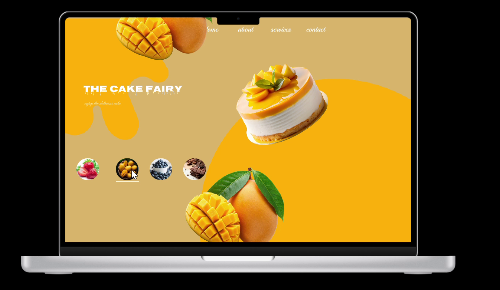

# 🎂 Cake Fairy – Figma UI Showcase

The **Cake Fairy landing page**, designed in **Figma** and built with **HTML & CSS**, featuring a simple and responsive layout.

---
## 🎨 Includes
- Elegant and modern **cake ordering app UI**
- Sweet pastel **color theme** (pink & cream inspired)
- Smooth **UI flow demo** recorded from Figma
- Clean **video embed** to showcase the prototype
- **Hosted live on GitHub Pages**

---
## 🌐 Live Demo
🔗 [View Project on GitHub Pages](https://mohana0304.github.io/Cake_Fairy_ui/
)

---
## 📂 Files Included
- `index.html` – Landing page for demo preview and Figma prototype link.
- `cake_fairy.mp4` – Demo preview video (Figma output).
- `preview.png` – Screenshot preview of the prototype.
- `README.md` – Documentation file.

---
## 🎞️ Demo Preview
Figma prototype exported as **demo video**.  

📽️ `cake_fairy.mp4` is embedded directly in the live page.
---

## 🚀 Figma Prototype
Explore the interactive prototype here:  
[Open Figma Prototype](https://www.figma.com/proto/4n3EnSgDIzjRn97vDTa7Ue/cake_fairy?node-id=9-3&starting-point-node-id=9%3A3&content-scaling=responsive)

---

## 📸 Preview
Here’s a screenshot from the demo video:

---

✨ Designed with creativity – **Cake Fairy**
